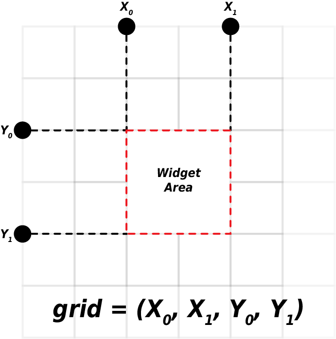

> Python based rapid prototyping framework for research related activities.

## Introduction
Python based rapid prototyping framework for research related activities.

## Main features

## Installing
Information regarding installation.

## Usage example(s)
````python
# -*- coding: utf-8 -*-
import pysential
from pysential_test import (ScreenRecorder, TestModule)


def main() -> None:
    app = pysential.application()

    app.load_image_package('./pysential_images.zip')
    app.add_splash(img='splash_loading', text="")
    app.set_main_window(title="PySential", img='logo')
    app.set_bg(img='bg')

    app.add_module(ScreenRecorder)
    app.add_module(TestModule)

    app.run()


if __name__ == '__main__':
    main()

````



## Documentation
We have to add the documentation here.

## Authors and acknowledgements

## Changelog

## License
License information.
